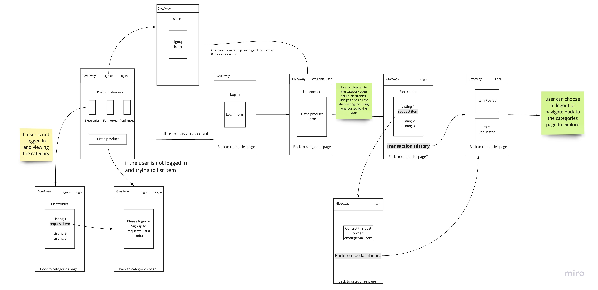
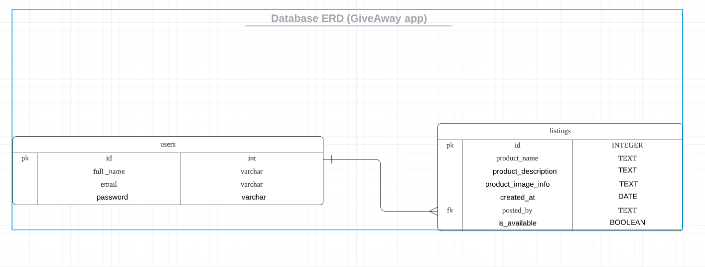

# GiveAway

## 🪴 What does the app do

GiveAway connects people who are willing to give away stuff (electronics/furniture, etc.. in good/ working condition) they do not use or need anymore to someone who needs that particular product.

## What problem does the app solve,

A. Reduce carbon footprint. Increase product life span.

## For whom?

For all of us. Encouraging us to do our bit to reduces global carbon emission by giving away the electronics / any goods, not in use but working condition.

## 👥 User story:

##### Who are the users?

Environmentally conscious people. Someone who realizes climate change is a burning problem for us and willing to do their bit in reducing our carbon footprint.

##### What are users goal?

Giving away unused items they own. And finding the item they need.

##### User journey

Say user 'A' has a hairdryer, perfectly working condition. And does not use it because s/he upgraded.
'A' as an environmentally aware and good soul lists the hairdryer on the 'GiveAway' app.
user 'B' needs a new hairdryer goes to GiveAway to check if the product s/he needs is available on the platform. If they find the product they connects with the user 'A' who listed the product.
They can decide on the exchange and related logistics.
User 'B' either thanks user 'A' for the generosity or buys him a beer.

## What data does the app handle?

- User signup information
- Product listings data.
- Product requests data.

