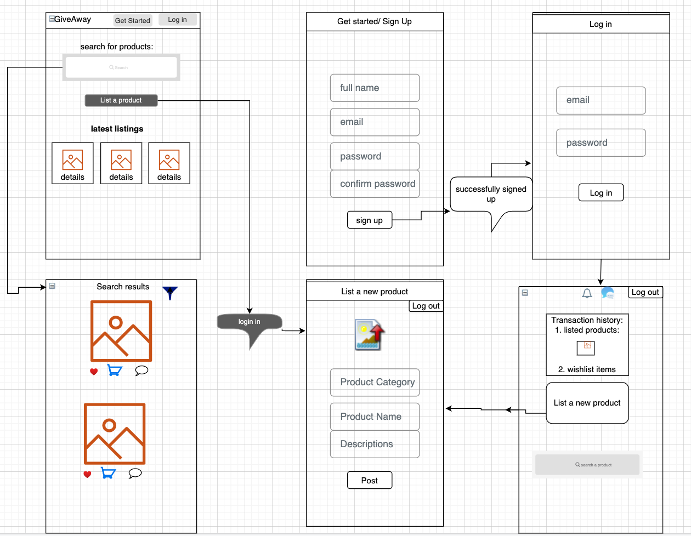

# GiveAway

## 🪴 What does the app do

GiveAway connects people who are willing to give away stuff (electronics/furniture, etc.. in good/ working condition) they do not use or need anymore to someone who needs that particular product.

## What problem does the app solve,

A. Reduce carbon footprint. Increase product life span.

## for whom?

A. For all of us. Encouraging us to do our bit to reduces global carbon emission by giving away the electronics / any goods, not in use but working condition.

## How does the app solve the problem?

A. Solving problem.

Let’s start with a background story:

Not too long ago, maybe 4-5 decades ago. We had and lived in close communities. Resources were scarce and we relayed on each other. We need equipment we did not have, we went to the neighbor. They needed something, we helped. Stuff changed hands and we breath fresh air and enjoyed timely rain and sunshine.

And then, we all got rich (rather stuff got cheap). Then we mass-produced. We bought in mass (COSCO, GAINT, what not…) We, kept producing and kept buying nonstop. And we lack fresh air to breathe. All of us. Fresh air is long gone, and if we don’t pay attention, our species will be gone soon (sorry, too dark).

The core idea behind this app is that we give away things we barely used or stopped using and now are collecting dust. We can’t go back to living in a society of borrowing/ lending things but if we want we can give away (for free, of course) and do our bit to reduce the carbon footprint of producing that one product!

## 👥 User story:

##### Who are the users?

Environmentally conscious people. Someone who realizes climate change is a burning problem for us and willing to do their bit in reducing our carbon footprint.

##### Who are users goal?

Giving away unused items they own. And finding the item they need.

##### User journey

Say user 'A' has a hairdryer, perfectly working condition. And does not use it because s/he upgraded.
'A' as an environmentally aware and good soul lists the hairdryer on the 'GiveAway' app.
user 'B' needs a new hairdryer goes to GiveAway to check if the product s/he needs is available on the platform. If they find the product they connects with the user 'A' who listed the product.
They can decide on the exchange and related logistics.
User 'B' either thanks user 'A' for the generosity or buys him a beer.

## What data does the app handle?

User signup information
Inventories of the product listing.

