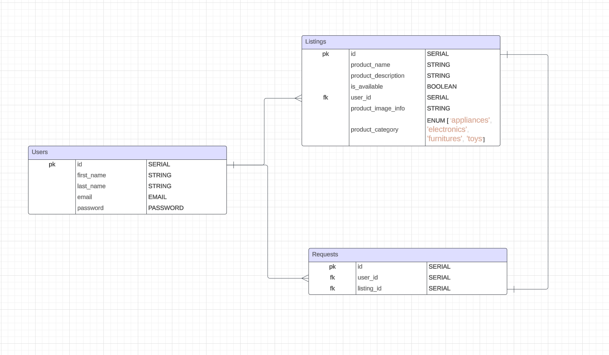

# GiveAway

## What does the app do

GiveAway connects people who are willing to give away stuff (electronics/furniture, etc.. in good/ working condition) they do not use or need anymore to someone who needs that particular product.

## What problem does the app solve,

Reduce carbon footprint. Increase product life span.

## For whom?

For all of us. Encouraging us to do our bit to reduces global carbon emission by giving away the electronics / any goods, not in use but working condition.

## 👥 User story:

##### Who are the users?

Environmentally conscious people. Someone who realizes climate change is a burning problem for us and willing to do their bit in reducing our carbon footprint.

##### What are users goal?

Giving away unused items they own. And finding a product they need.

##### User journey

- Say user 'A' has a hairdryer, perfectly working condition. And does not use it because s/he upgraded.

- 'A' as an environmentally aware and good soul lists the hairdryer on the 'GiveAway' app.

- user 'B' needs a new hairdryer goes to GiveAway to check if the product s/he needs is available on the platform. If they find the product they connects with the user 'A' who listed the product.

- They can decide on the exchange and related logistics.

- User 'B' either thanks user 'A' for the generosity or buys him a beer.

## Wireframe


## What data does the app handle?

- User signup information
- Product listings data.
- Product requests data.



# Demo Video

Check out the demo video to get a quick overview of how GiveAway works:
Watch the demo video here:

[](https://youtu.be/dSa4IoxDuTU)

# Installation Instructions

- Clone the Repository

```bash
git clone https://github.com/jokatty/give-away-express-app.git
```

- Navigate to the Project Directory

`cd give-away-express-app`

- Install Dependencies

`npm i`

## Development Setup

- Run the application
  `npm start`
- Visit the Application
  ` http://localhost:3004`

## Technologies used

- Frontend: ejs
- Backend: Express
- Database: PostgreSQL
- ORM: Sequelize
